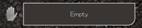
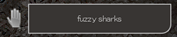
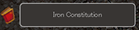
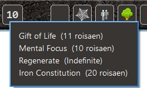
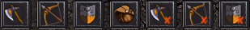
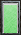
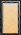
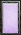
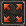
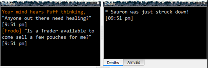

## User Interface

The Frostbite application has a number of GUI elements such as the toolbar, movable game windows,
navigation compass, round time display and the timer bar. This chapter describes Frostbite client
GUI in more detail.

### Toolbar

The toolbar is located on the top of the main story window by default but can be moved to the bottom of the
screen and can be completely hidden from the right-click context menu. Toolbar gives a quick overview of the
character status and provides some control functions for the client.

#### Items held in left or right hand.

#### Prepared spells (only visible in a mouse cursor activated tooltip).

Spell timer shows the lowest active spell on toolbar and is only fully visible as a list of
active spells when hovered over by the mouse cursor.

#### Status

| |  |  |  |  |  |
|---------|------|-------|------|--------|--------|
|invisible|webbed|grouped|hidden|bleeding|standing|
|         |      |       |      |stunned |kneeling|
|         |      |       |      |dead    |sitting |
|         |      |       |      |        |prone   |

Configurable quick-buttons can be invoked by left mouse click and actions can be edited by 
right-clicking on the buttons.

#### Character vitals

||||||
| -------- | ----- | ------------- | ------- | ------ |
| health   | mana  | concentration | fatigue | spirit |

Full screen button allows to enter into full screen mode to make the full use out of all the
available screen space.

#### Dock windows

The detachable dock windows can stream data in the background separately from the main story window to display real 
time data such as player experience, conversations, familiars, active spells, room descriptions, etc.
The information about thoughts, arrivals and deaths are only shown in the dock windows and are not displayed
anywhere else on the screen. Data for dock windows is always being collected regardless of the windows being
open or closed and any previously collected data will be again visible once a dock window is reopened.

The standard Qt GUI allows stacking dock windows on top of each other or placing them adjacently to each side. In the 
main window area the dock windows can be placed on top, left or right of the screen.

#### Navigation compass

The navigation compass helps to better understand and visualize available movement paths in
the game. It can be found in the bottom right corner of the main story window.

The center area of the navigation compass is reserved for the auto-pilot indicator. It shows script
status. Active mode is indicated by red color -- meaning that a script is activated and executing.

### Timer bar

The timer bar enables to displays timers for actions that are not regulated by in-game round times. For example
boat travel or aiming a ranged weapon. Timers can be triggered by any text highlighter event, configured
from the highlighting menu.

