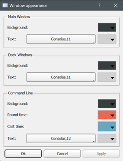
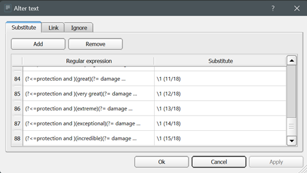

## Client settings

The Frostbite frontend is still a work in progress and not all functions in the
application can be configured.
It is currently possible to customize appearance of the game windows, set user macros,
filter highlighted text, add text substitutions or ignores and configure quick button actions.

> Please note that some client settings are hard-coded into
> the Frostbite application software and can only be changed
> in the source code.
> To make changes to the source code refer to the [development](/development) page.

### Appearance dialog

Can be opened from the main menu (preferences for Max OS X). Users can change the appearance of 
window colors and fonts; command line color and fonts; round time and cast time colors. 

Please note that while the font selector has a large selection of system fonts available, the text formatting 
expects a monospace/fixed-width fonts to be used.

### Highlight dialog

Can be opened from the main menu and is used for text color highlighting.

The highlight dialog is divided into three subcategories.

* General highlights are static values and can only be changed in color;
* Text highlights allow dynamic entries and triggers for timers;
* Alerts can play sounds on predetermined in-game events.

Users can add new highlights by clicking on the add button.
To change highlight text color click the right mouse button on the highlight
item and choose "Change color" from the menu.

### Text alterations

> Some caution is advised when adding text alterations. As a result text can completely disappear from view or
> cause malformed text to appear. It is important to note that text contains hidden HTML symbols and entities
> such as &lt;, &gt;, &amp;quot; etc.

Text alteration dialog is located in the main menu. Alterations can be used to make real time changes to
the text shown on screen.

To target alterations to specific windows or temporarily disable alterations press right-click on the target
alteration item to open the menu.

Text substitutes replace text matched by the regular expression and text ignores can be used to ignore an
entire line if text match is found.

Text matching in alterations is based on a Perl-compatible regular expression engine. All invalid regular
expressions are treated as void entries and displayed as red background on the input field.

### Common characters and abbreviations

|**c** |Character represents itself unless it has a special regexp meaning.|**\d**|Matches a digit.|                        |
|**\c**|A character that follows a backslash matches the character itself. |**\D**|Matches a non-digit.                     |
|**\a**|Matches the ASCII bell (BEL, 0x07).                                |**\s**|Matches a whitespace character.          |
|**\f**|Matches the ASCII form feed (FF, 0x0C).                            |**\S**|Matches a non-whitespace character.      |
|**\n**|Matches the ASCII line feed (LF, 0x0A, Unix newline).              |**\w**|Matches a word character.                |
|**\r**|Matches the ASCII carriage return (CR, 0x0D).                      |**\W**|Matches a non-word character.            |
|**\t**|Matches the ASCII horizontal tab (HT, 0x09).                       |**\n**|The n-th backreference, e.g. \1, \2, etc.|
|**.** |(dot)	Matches any character (including newline).                 |      |                                         |

### Macros/Sequences

Macros let users bind game commands to specified key combinations. In addition to macros Frostbite frontend
also supports key sequences, meaning that you can delay a predetermined amount of time between each command, which
makes it possible to enter 3 or more commands in a single sequence (game only supports 2 consecutive commands).

For example running a command sequence - *"look$nlook$slook$n"*,
will wait before executing the last command for a predetermined amount of time.
The sequence timer can be configured from the macro dialog.

### Keywords used in macros

* $n - new line
* $s - new sequence line (pauses for sequence time and then puts a new line)
* @  - caret position (only eligible with no trailing $n or $s commands)

### Quick button actions

Quick button actions can be changed by clicking the right mouse button on the target button.

