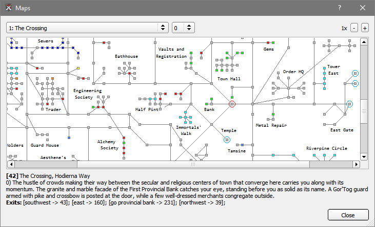
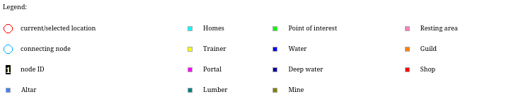

## Maps

Frostbite frontend loosely follows the Genie Map <a href="xsd/map.xsd">schema</a> to process and display maps.
Map files have to be placed in the *"/maps"* folder during application start up and any changes to map files require
a restart to take effect.

Genie Map files are available to download at
[https://github.com/GenieClient/Maps](https://github.com/GenieClient/Maps)
-> Download a zip of all the maps.

### Map

To open the map dialog window press right mouse click on the map window and select view maps option.

### Map movement and functions

All map data and tools can be accessed through the scripting [API](../api/models/Map.html).

Map consists of nodes (rooms) and arcs (movement paths). Map nodes can be selected by the left mouse click.
The selected node (red circle) is used as a point of reference in all related functions.

Map window tries to keep track of room movement by matching the room title,
description and movement paths to source room data. Finding current location on the map 
is only possible if unique match is found in source files.

More detailed node information is accessible through the map dialog. To open the map dialog press right-click on the map 
window and open the map dialog from the menu.

Node IDs can be viewed by hovering mouse cursor over the map node and can be used in the scripting API to find paths
between originating and destination nodes.

It is important to note that paths between two nodes can be found only if they are located in the same map 
zone. The movement paths in the API are found using a simple breadth-first search algorithm and do not
always correlate to the best available paths to take in game and should be used with 
caution accordingly.